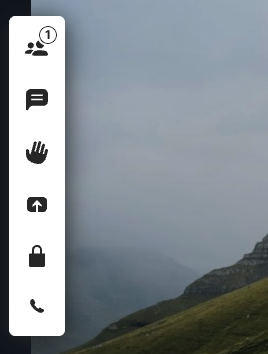
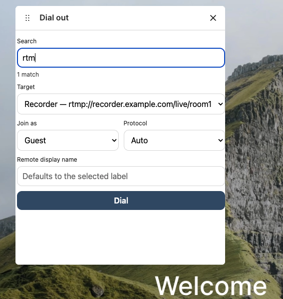
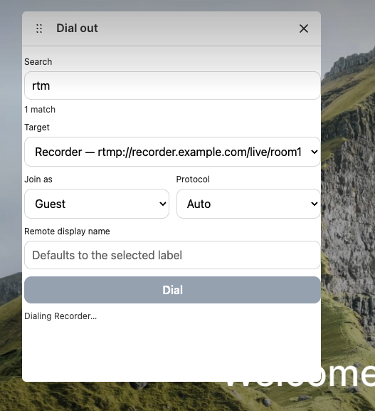

# Pexip Web App 3 Dial-Out Picker Plugin

A **Pexip Infinity Web App 3 plugin** that adds a **host-only toolbar button** allowing a chair/host to **dial out** to a participant from a pre-defined list.

This branch adds a **searchable dial-out target picker** to make it easier to use large lists.

---

## Features

- ✅ Host-only toolbar button (chair role)
- ✅ Dial-out targets loaded from a bundled CSV file
- ✅ Fallback list if CSV cannot be loaded
- ✅ Search box that filters the dial-out target list as you type
- ✅ Supports SIP / H.323 / RTMP / MS SIP (depending on Infinity configuration)
- ✅ Uses `remote_display_name` + `text` for dial-out labeling
- ✅ Uses the Infinity Web App defaults for caller identity (we do **not** send `source_display_name`)

---

## Screenshots

### Toolbar button (host/chair only)


### Searchable dial-out picker widget


### Dial started confirmation


---

## CSV Dial-Out List

The plugin reads a CSV file from:

```
./data/dial_targets.csv
```

### CSV format

```csv
label,destination,protocol,role
Boardroom (SIP),sip:ep3@anzsec.pextest.com,,guest
Security desk (SIP),sip:security@company.com,,guest
Legacy codec,h323:10.0.0.50,h323,guest
Recorder,rtmp://recorder.example.com/live/room1,rtmp,guest
```

### Columns

| Column        | Required | Description |
|--------------|----------|-------------|
| `label`       | ✅ Yes | Display name shown in the target list |
| `destination` | ✅ Yes | Dial-out destination (e.g. `sip:user@domain`, `h323:ip`, `rtmp://...`) |
| `protocol`    | ❌ No  | `sip`, `h323`, `mssip`, `rtmp`, or blank |
| `role`        | ❌ No  | `guest` or `host` |

> **Note:** Some Infinity environments reject `"protocol": "sip"` even if supported in the Web App API.  
> If you see `unsupported protocol 'sip'`, leave the protocol blank and use a `sip:` destination.

---

## How Search Works (This Branch)

The standard `plugin.ui.showForm()` select dropdown does **not** support live filtering.

To support *filter-as-you-type* searching, this branch uses a **floating plugin widget** (`widget.html`) which implements:
- a search input box
- a filtered select list updated on each keypress

---

## Development

### Prerequisites
- Node.js 18+ recommended
- npm (or yarn/pnpm)

### Install dependencies
```bash
npm install
```

### Build plugin
```bash
npm run build
```

---

## Vite Configuration (Multi-page Build)

This branch includes both:

- `index.html` (plugin entry)
- `widget.html` (search UI)

Your `vite.config.js` **must** include both inputs:

```js
import { defineConfig } from "vite";

export default defineConfig({
  base: "./",
  build: {
    rollupOptions: {
      input: {
        index: "./index.html",
        widget: "./widget.html",
      },
    },
  },
});
```

If `widget.html` is missing from `dist/`, the plugin will fail to load the search UI.

---

## Installing into Pexip Infinity Branding

After building, the plugin should be copied into your Web App 3 branding folder like:

```
webapp3/
  branding/
    manifest.json
    plugins/
      dialout-picker/
        index.html
        widget.html
        assets/
          ...
        data/
          dial_targets.csv
```

### Example `manifest.json`

```json
{
  "plugins": [
    {
      "id": "dialout-picker",
      "src": "./plugins/dialout-picker/index.html"
    }
  ]
}
```

---

## Verifying the Plugin Loaded

Open DevTools → Network and confirm these load with **200**:

- `/webapp3/branding/manifest.json`
- `/webapp3/branding/plugins/dialout-picker/index.html`
- `/webapp3/branding/plugins/dialout-picker/widget.html`
- `/webapp3/branding/plugins/dialout-picker/data/dial_targets.csv`
- `/webapp3/branding/plugins/dialout-picker/assets/...`

If `widget.html` returns **404**, check:
- it exists in `dist/`
- it was copied into the branding ZIP
- your Vite multi-page build config is applied

---

## Notes / Troubleshooting

### `widget.html` 404 in Network tab
This means the widget is not available at the expected path. Fix checklist:

1. Confirm build output:
   ```bash
   ls -la dist
   ```

2. Confirm branding package includes the widget:
   ```
   webapp3/branding/plugins/dialout-picker/widget.html
   ```

3. Confirm you uploaded + applied the correct branding package
4. Hard refresh the Web App (`Cmd+Shift+R`)

### Dial fails with HTTP 400
Check the response body in Network tab. Common causes:
- invalid destination format
- unsupported protocol
- dial-out disabled on the Infinity deployment

---

## Security Notes

This plugin uses a **local CSV file** bundled into the branding package.
No external calls are made outside the Pexip Infinity Client API.

If you expand this project to load targets dynamically from an external API:
- validate input
- restrict dial-out targets
- avoid exposing sensitive endpoints in client-side JS

---

## License

Internal / private project (update as required).
